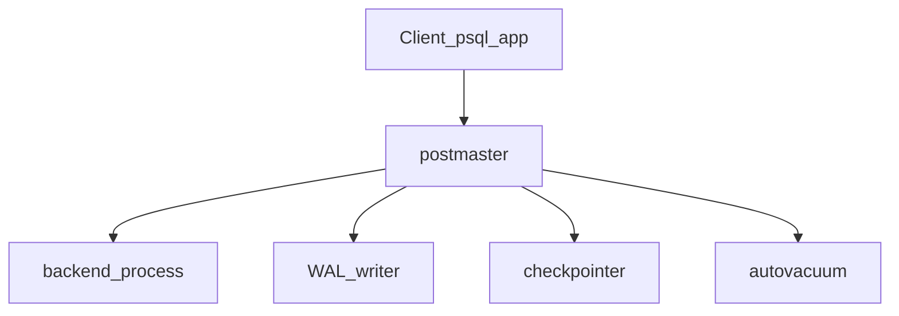

# PostgreSQL 核心内容与最佳实践

> 目标：系统掌握 PostgreSQL 的架构、SQL 能力、事务与 MVCC、索引与调优、运维与安全，并能落地到生产实践。
> 适用：有 SQL 基础（如 MySQL）的开发者；文中会标注与 MySQL 的关键差异。

---

## 目录

1. [PostgreSQL 是什么](#1-postgresql-是什么)
2. [架构与核心机制](#2-架构与核心机制)
3. [对象层次与命名规范](#3-对象层次与命名规范)
4. [数据类型要点](#4-数据类型要点)
5. [SQL 核心能力](#5-sql-核心能力)
6. [索引体系](#6-索引体系)
7. [事务、MVCC 与并发](#7-事务mvcc-与并发)
8. [Vacuum 与表膨胀](#8-vacuum-与表膨胀)
9. [高级特性](#9-高级特性)
10. [性能调优](#10-性能调优)
11. [安全与权限](#11-安全与权限)
12. [备份、恢复与高可用](#12-备份恢复与高可用)
13. [最佳实践清单](#13-最佳实践清单)
14. [学习计划](#14-学习计划)
15. [速查](#15-速查)

---

## 1. PostgreSQL 是什么

PostgreSQL（简称 PG）是开源的**对象-关系型数据库**（ORDBMS），以标准 SQL 兼容、扩展性强、事务可靠著称。

**核心优势：**

| 维度 | 说明 |
| --- | --- |
| 标准 SQL | 窗口函数、CTE、UPSERT、RETURNING 等原生支持完善 |
| 扩展生态 | `jsonb`、全文检索、地理信息（PostGIS）、向量（pgvector）等 |
| MVCC | 读不阻塞写，写不阻塞读（普通 SELECT 不加行锁） |
| 可靠性 | WAL + 崩溃恢复 + PITR 时间点恢复 |
| 类型系统 | 丰富且可自定义（枚举、复合类型、域类型） |

**与 MySQL（InnoDB）常见差异：**

| 主题 | PostgreSQL | MySQL (InnoDB) |
| --- | --- | --- |
| 默认隔离级别 | Read Committed | Repeatable Read |
| 布尔类型 | 原生 `boolean` | 常用 `TINYINT(1)` 模拟 |
| UPSERT | `ON CONFLICT ... DO UPDATE` | `ON DUPLICATE KEY UPDATE` |
| 自增主键 | `GENERATED ... AS IDENTITY`（推荐）或 `SERIAL` | `AUTO_INCREMENT` |
| 字符串拼接 | `\|\|` 或 `concat()` | `CONCAT()` |
| 标识符引用 | 双引号 `"col"` | 反引号 `` `col` `` |
| 大小写 | 未加引号的标识符会**折叠为小写** | 取决于 OS 与 `lower_case_table_names` |
| 删除后空间 | 需 VACUUM 回收 | InnoDB 有 purge，机制不同 |

---

## 2. 架构与核心机制

### 2.1 进程架构



- **postmaster**：主进程，监听连接、派生子进程。
- **backend process**：每个客户端连接对应一个后端进程（**一连接一进程**，连接数过高时内存压力大）。
- **WAL writer / checkpointer / autovacuum**：后台维护 WAL、刷盘、清理死元组。

### 2.2 存储与 WAL

- 数据文件在 `data_directory`（可用 `SHOW data_directory;` 查看）。
- 所有变更先写 **WAL（Write-Ahead Log）**，再异步刷到数据页——崩溃后通过 WAL **重做**恢复。
- 检查点（checkpoint）将脏页落盘，缩短恢复时间。

### 2.3 MVCC 简述

每行数据带有事务可见性标记（`xmin` / `xmax`）。`UPDATE` 实际是**插入新版本 + 标记旧版本死亡**，旧版本由 VACUUM 清理。

因此：

- 普通 `SELECT` 不需要读锁，并发好。
- 大量 `UPDATE`/`DELETE` 会产生**表膨胀**（bloat），必须依赖 autovacuum。
- `SERIALIZABLE` 隔离级别用 **SSI（Serializable Snapshot Isolation）** 检测读写冲突。

---

## 3. 对象层次与命名规范

### 3.1 层次关系


| 层级 | 说明 |
| --- | --- |
| Cluster | 一次 `initdb` 创建的实例，共享进程与配置 |
| Database | 逻辑库，连接时指定 `dbname` |
| Schema | 命名空间，默认 `public` |
| Table / View / Function | 模式下的对象 |

**注意：** PG 的 `database` ≈ MySQL 的「库」；PG 的 `schema` 在 MySQL 里没有直接对应（更接近「库内的命名空间」）。

### 3.2 命名规范（生产推荐）

| 建议 | 说明 |
| --- | --- |
| 全小写 + 下划线 | `order_item`，避免双引号大小写敏感问题 |
| 表名复数或单数二选一 | 团队统一即可，如 `users` / `user` |
| 主键 `id` 或 `表名_id` | 外键 `user_id` 指向 `users(id)` |
| 时间字段 | `created_at` / `updated_at`，类型用 `timestamptz` |
| 软删除 | `deleted_at timestamptz` 优于魔法值 |

### 3.3 常用 psql 命令

```bash
# 连接
psql -h localhost -U postgres -d mydb

# 元数据
\l          # 列出数据库
\c mydb     # 切换数据库
\dn         # 列出 schema
\dt         # 当前 schema 下的表
\dt public.* 
\d users    # 表结构
\du         # 角色
\x          # 扩展显示（宽结果）
\timing on  # 显示执行时间
```

```sql
SHOW data_directory;
SELECT datname FROM pg_database;
SELECT current_database(), current_schema();
```

---

## 4. 数据类型要点

### 4.1 常用标量类型

| 类型 | 说明 | 实践建议 |
| --- | --- | --- |
| `integer` / `bigint` | 整数 | 主键、计数用 `bigint` 更稳妥 |
| `numeric(p,s)` | 精确小数 | **金额必须用 numeric**，不用 `float` |
| `text` / `varchar(n)` | 字符串 | 无性能差异时优先 `text` |
| `boolean` | 布尔 | 三值逻辑：`TRUE` / `FALSE` / `NULL` |
| `uuid` | UUID | 分布式 ID；可配合 `gen_random_uuid()`（pgcrypto） |
| `bytea` | 二进制 | 小对象可以；大文件放对象存储 |

### 4.2 时间与日期

| 类型 | 说明 |
| --- | --- |
| `timestamp` | 无时区，**不推荐**存业务时间 |
| `timestamptz` | 带时区，**推荐**；内部 UTC，按会话时区显示 |
| `date` / `time` | 仅日期 / 仅时间 |
| `interval` | 时间间隔 |

```sql
-- 推荐：业务时间一律 timestamptz
created_at timestamptz NOT NULL DEFAULT now()
```

### 4.3 JSON 与数组

```sql
-- json：存文本；jsonb：二进制、可索引，生产首选 jsonb
CREATE TABLE events (
  id         bigint PRIMARY KEY,
  payload    jsonb NOT NULL,
  tags       text[]
);

-- 查询
SELECT * FROM events WHERE payload->>'type' = 'login';
SELECT * FROM events WHERE payload @> '{"type":"login"}';
SELECT * FROM events WHERE 'urgent' = ANY(tags);
```

**jsonb 索引：**

```sql
CREATE INDEX idx_events_payload ON events USING gin (payload);
CREATE INDEX idx_events_type ON events ((payload->>'type'));
```

### 4.4 自增主键

```sql
-- 推荐：SQL 标准 IDENTITY（PG 10+）
CREATE TABLE users (
  id bigint GENERATED ALWAYS AS IDENTITY PRIMARY KEY,
  email text NOT NULL
);

-- 兼容写法：SERIAL / BIGSERIAL（本质是 sequence + 默认值）
-- 插入指定 id 时 IDENTITY 需 OVERRIDING SYSTEM VALUE
```

---

## 5. SQL 核心能力

### 5.1 DDL 片段

```sql
CREATE TABLE orders (
  id           bigint GENERATED ALWAYS AS IDENTITY PRIMARY KEY,
  user_id      bigint NOT NULL REFERENCES users(id),
  status       text NOT NULL DEFAULT 'pending'
               CHECK (status IN ('pending','paid','shipped','cancelled')),
  amount       numeric(12,2) NOT NULL CHECK (amount >= 0),
  created_at   timestamptz NOT NULL DEFAULT now(),
  updated_at   timestamptz NOT NULL DEFAULT now()
);

CREATE INDEX idx_orders_user_created ON orders (user_id, created_at DESC);
```

### 5.2 DML 与 RETURNING

```sql
INSERT INTO users (email) VALUES ('a@b.com') RETURNING id, created_at;

UPDATE orders SET status = 'paid', updated_at = now()
WHERE id = 1 RETURNING *;

DELETE FROM users WHERE id = 10 RETURNING email;
```

`RETURNING` 可减少一次往返，应用层常用来拿自增 ID 或审计字段。

### 5.3 UPSERT（ON CONFLICT）

```sql
INSERT INTO users (email, name)
VALUES ('a@b.com', 'Alice')
ON CONFLICT (email) DO UPDATE
  SET name = EXCLUDED.name,
      updated_at = now();
```

需要 **唯一约束或唯一索引**（如 `UNIQUE (email)`）才能触发 `ON CONFLICT`。

### 5.4 CTE（WITH）

```sql
WITH recent AS (
  SELECT * FROM orders
  WHERE created_at >= now() - interval '7 days'
)
SELECT u.email, count(*) AS cnt
FROM recent r
JOIN users u ON u.id = r.user_id
GROUP BY u.email;
```

- CTE 提高可读性；PG 12+ 对 **非递归 CTE** 可内联优化（视情况而定）。
- **递归 CTE** 适合树形结构（组织、评论楼中楼）。

### 5.5 窗口函数

```sql
SELECT
  user_id,
  amount,
  sum(amount) OVER (PARTITION BY user_id ORDER BY created_at) AS running_total,
  row_number() OVER (PARTITION BY user_id ORDER BY created_at DESC) AS rn
FROM orders;
```

典型用途：排名、累计、同比环比、去重取最新一条（`rn = 1`）。

### 5.6 分页

```sql
-- 小偏移
SELECT * FROM orders ORDER BY id LIMIT 20 OFFSET 40;

-- 大表深分页：用 keyset（seek）分页
SELECT * FROM orders
WHERE id > :last_id
ORDER BY id
LIMIT 20;
```

大偏移 `OFFSET` 会扫描并丢弃大量行，**深分页优先 keyset**。

---

## 6. 索引体系

### 6.1 索引类型选择

| 类型 | 适用场景 |
| --- | --- |
| **B-tree**（默认） | 等值、范围、排序、`LIKE 'prefix%'` |
| **Hash** | 仅等值（较少用；PG 10+ 支持 WAL） |
| **GIN** | `jsonb`、数组、全文检索 |
| **GiST** | 几何、范围类型、相似度（pg_trgm） |
| **BRIN** | 超大表、物理顺序与查询范围强相关（时序） |

### 6.2 设计原则

1. **WHERE / JOIN / ORDER BY** 高频列优先考虑。
2. **复合索引**遵循**最左前缀**（与 MySQL 类似）。
3. 选择性低的列单独索引收益小（如纯布尔列）；可建 **部分索引**。
4. 覆盖查询用 **INCLUDE**（PG 11+）减少回表。

```sql
-- 部分索引：只索引活跃订单
CREATE INDEX idx_orders_open ON orders (user_id)
WHERE status IN ('pending', 'paid');

-- 表达式索引
CREATE INDEX idx_users_lower_email ON users (lower(email));

-- 覆盖索引
CREATE INDEX idx_orders_user_inc ON orders (user_id) INCLUDE (amount, status);
```

### 6.3 执行计划分析

```sql
EXPLAIN (ANALYZE, BUFFERS, FORMAT TEXT)
SELECT * FROM orders WHERE user_id = 1 AND status = 'paid';
```

关注：`Seq Scan` vs `Index Scan`、`Nested Loop` vs `Hash Join`、**actual rows** 与估计偏差、buffer 命中。

维护统计信息：

```sql
ANALYZE orders;
-- 或全库
VACUUM ANALYZE;
```

---

## 7. 事务、MVCC 与并发

### 7.1 基本语法

```sql
BEGIN;
-- 或 START TRANSACTION;

COMMIT;
ROLLBACK;

SAVEPOINT sp1;
ROLLBACK TO SAVEPOINT sp1;
```

```sql
SHOW transaction_isolation;
SET TRANSACTION ISOLATION LEVEL REPEATABLE READ;
```

### 7.2 隔离级别

| 级别 | 脏读 | 不可重复读 | 幻读 | PG 行为摘要 |
| --- | --- | --- | --- | --- |
| Read Uncommitted | — | — | — | PG 中实际等同 RC |
| **Read Committed**（默认） | 否 | 是 | 是 | 每条语句新快照 |
| Repeatable Read | 否 | 否 | 否* | 事务级快照；*幻读由 SSI 在 Serializable 严格处理 |
| Serializable | 否 | 否 | 否 | 可能 `40001 serialization_failure`，需重试 |

**应用建议：**

- 默认 RC 对大多数 OLTP 足够。
- 需要稳定多次读取同一快照时用 RR。
- Serializable 适合强一致但要处理**重试**（乐观并发）。

### 7.3 锁与典型问题

```sql
-- 行级锁
SELECT * FROM orders WHERE id = 1 FOR UPDATE;
SELECT * FROM orders WHERE id = 1 FOR SHARE;

-- 咨询锁（跨会话协调）
SELECT pg_advisory_lock(12345);
SELECT pg_advisory_unlock(12345);
```

- 长事务会阻碍 VACUUM，导致膨胀与性能下降。
- 批量任务控制批次大小，避免一次锁住大量行。
- 访问顺序一致（如先 `users` 再 `orders`）可降低死锁概率。

### 7.4 死锁排查

```sql
-- 查看最近死锁（需 log_lock_waits / deadlock_timeout 等配置配合日志）
SELECT * FROM pg_locks WHERE NOT granted;
```

日志中出现 `deadlock detected` 时，按提示调整 SQL 顺序或缩小事务范围。

---

## 8. Vacuum 与表膨胀

### 8.1 为什么需要 VACUUM

- 清理 MVCC 留下的**死元组**。
- 更新**可见性映射**与**空闲空间映射**（供后续插入复用）。
- **ANALYZE** 更新规划器统计信息（autovacuum 可一并执行）。

### 8.2 autovacuum

生产环境**必须开启** autovacuum（默认开启）。关注：

| 参数 | 含义 |
| --- | --- |
| `autovacuum_vacuum_scale_factor` | 表变更比例触发 vacuum |
| `autovacuum_analyze_scale_factor` | 触发 analyze |
| `autovacuum_vacuum_cost_delay` | IO 节流 |

大表可调低 `scale_factor` 或使用**表级存储参数**单独配置。

### 8.3 监控膨胀

```sql
-- 需安装扩展 pgstattuple 或使用监控视图/脚本
SELECT schemaname, relname, n_live_tup, n_dead_tup, last_autovacuum
FROM pg_stat_user_tables
ORDER BY n_dead_tup DESC;
```

**实践：**

- 避免默认 `fillfactor = 100` 的高频更新大表；可设 `fillfactor = 85` 留 HOT 更新空间。
- 极高膨胀时：`VACUUM (FULL)` 或 `pg_repack`（在线重组，生产更常用 repack）。

---

## 9. 高级特性

### 9.1 视图与物化视图

```sql
CREATE VIEW active_users AS
SELECT id, email FROM users WHERE deleted_at IS NULL;

CREATE MATERIALIZED VIEW monthly_sales AS
SELECT date_trunc('month', created_at) AS month, sum(amount) AS total
FROM orders GROUP BY 1;

REFRESH MATERIALIZED VIEW CONCURRENTLY monthly_sales;
-- 需要唯一索引支持 CONCURRENTLY
```

### 9.2 函数与 PL/pgSQL

```sql
CREATE OR REPLACE FUNCTION set_updated_at()
RETURNS trigger AS $$
BEGIN
  NEW.updated_at := now();
  RETURN NEW;
END;
$$ LANGUAGE plpgsql;

CREATE TRIGGER trg_orders_updated
BEFORE UPDATE ON orders
FOR EACH ROW EXECUTE FUNCTION set_updated_at();
```

复杂业务可放 DB 层，但**过度逻辑下沉**会增加测试与发布难度——按团队边界取舍。

### 9.3 分区表

```sql
CREATE TABLE measurements (
  id bigint GENERATED ALWAYS AS IDENTITY,
  device_id int NOT NULL,
  measured_at timestamptz NOT NULL,
  value numeric NOT NULL
) PARTITION BY RANGE (measured_at);

CREATE TABLE measurements_2026_01 PARTITION OF measurements
  FOR VALUES FROM ('2026-01-01') TO ('2026-02-01');
```

- 时序、日志类大表按时间 RANGE 分区最常见。
- 查询带分区键可 **partition pruning**。
- PG 11+ 支持分区表上的全局唯一约束（需包含分区键）。

### 9.4 扩展（Extensions）

```sql
CREATE EXTENSION IF NOT EXISTS pg_trgm;    -- 模糊搜索
CREATE EXTENSION IF NOT EXISTS pgcrypto;   -- 加密、gen_random_uuid
CREATE EXTENSION IF NOT EXISTS citext;     -- 大小写不敏感文本
```

### 9.5 全文检索

```sql
ALTER TABLE articles ADD COLUMN tsv tsvector
  GENERATED ALWAYS AS (to_tsvector('simple', coalesce(title,'') || ' ' || coalesce(body,''))) STORED;

CREATE INDEX idx_articles_tsv ON articles USING gin (tsv);

SELECT * FROM articles WHERE tsv @@ plainto_tsquery('simple', 'postgresql index');
```

### 9.6 复制与高可用（概念）

| 方式 | 说明 |
| --- | --- |
| 流复制（物理） | 主从 WAL 流式同步；只读副本 |
| 逻辑复制 | 表级发布/订阅，跨版本、异构更灵活 |
| 连接池 | **PgBouncer** 或 **Pgpool-II** 缓解连接数 |

---

## 10. 性能调优

### 10.1 关键配置（起步参考，需按内存与 workload 调整）

| 参数 | 作用 | 粗略建议 |
| --- | --- | --- |
| `shared_buffers` | 共享缓存 | 物理内存 25% 左右（常见 2–8GB 区间） |
| `effective_cache_size` | 规划器假设的 OS 缓存 | 物理内存 50–75% |
| `work_mem` | 排序/哈希每操作内存 | 小心设大 × 并发数 |
| `maintenance_work_mem` | VACUUM、CREATE INDEX | 可高于 work_mem |
| `max_connections` | 最大连接 | 宜小；配合连接池 |
| `random_page_cost` | 随机读成本 | SSD 可降到 1.1–1.5 |
| `wal_buffers` / `checkpoint_*` | WAL 与检查点 | 高写入场景细调 |

使用 `ALTER SYSTEM SET ...` 或编辑 `postgresql.conf`，`SELECT pg_reload_conf();` 重载部分参数。

### 10.2 查询层

- 避免 `SELECT *`，只取需要的列。
- 批量写入用 `COPY` 或多行 `INSERT`。
- 大结果集用游标或分页，避免一次拉爆内存。
- ORM 生成 SQL 要用 `EXPLAIN ANALYZE` 验证。

### 10.3 连接池

PG 一连接一进程，**几百连接**就可能吃满内存。应用侧：

- 使用 PgBouncer（transaction pooling 最常见）。
- 应用内连接池大小与 PG `max_connections` 协同规划。

---

## 11. 安全与权限

### 11.1 角色模型

PG 中 **ROLE 可表示用户或组**；`CREATE USER` 是 `CREATE ROLE LOGIN` 的别名。

```sql
CREATE ROLE app_readonly LOGIN PASSWORD '...';
GRANT CONNECT ON DATABASE mydb TO app_readonly;
GRANT USAGE ON SCHEMA public TO app_readonly;
GRANT SELECT ON ALL TABLES IN SCHEMA public TO app_readonly;
ALTER DEFAULT PRIVILEGES IN SCHEMA public
  GRANT SELECT ON TABLES TO app_readonly;
```

### 11.2 最小权限

| 角色 | 权限 |
| --- | --- |
| 应用读写 | `SELECT, INSERT, UPDATE, DELETE` 必要表 |
| 只读报表 | `SELECT` + 只读副本 |
| 迁移账号 | `DDL` 仅限 CI/CD，非常规时间窗口 |
| 超级用户 | **禁止**给应用；仅 DBA 本地管理 |

### 11.3 行级安全（RLS）

```sql
ALTER TABLE orders ENABLE ROW LEVEL SECURITY;

CREATE POLICY orders_isolation ON orders
  USING (user_id = current_setting('app.user_id')::bigint);
```

多租户 SaaS 可在 DB 层强制租户隔离（应用须 `SET app.user_id`）。

### 11.4 网络安全

- `pg_hba.conf`：限制来源 IP、认证方式（`scram-sha-256` 优于 `md5`）。
- 生产强制 **SSL/TLS**。
- 密钥不进仓库；用环境变量或密钥管理服务。

---

## 12. 备份、恢复与高可用

### 12.1 逻辑备份

```bash
# 自定义格式（推荐，可并行恢复）
pg_dump -Fc -h localhost -U postgres mydb -f mydb.dump

pg_restore -d mydb_restored -j 4 mydb.dump
```

- 单库备份用 `pg_dump`；集群级用 `pg_dumpall`（含全局对象）。
- 大数据量考虑目录格式 `-Fd` + 并行。

### 12.2 物理备份与 PITR

- `pg_basebackup`：基础备份 + WAL 归档 → **任意时间点恢复（PITR）**。
- 云托管（RDS、Cloud SQL、Aiven）通常提供自动备份与 PITR，策略按 RPO/RTO 选型。

### 12.3 恢复演练

**未演练的备份不算备份。** 季度至少一次恢复到隔离环境并校验数据与业务链路。

---

## 13. 最佳实践清单

### 13.1 建模与 SQL

- [ ] 主键用 `bigint` + `IDENTITY`（或雪花/UUID 有明确理由）。
- [ ] 金额 `numeric`；时间 `timestamptz`；布尔 `boolean`。
- [ ] 外键在 OLTP 中默认开启，批量 ETL 表可例外但需文档化。
- [ ] 重要字段 `NOT NULL` + 合理 `DEFAULT` + `CHECK`。
- [ ] 迁移用版本化工具（Flyway、Liquibase、sqitch、Rails migrations 等），禁止手工改生产。
- [ ] 深分页用 keyset；批量操作用 `LIMIT` 分批。

### 13.2 索引与性能

- [ ] 每个索引都有明确查询场景；定期清理无用索引。
- [ ] 变更后 `EXPLAIN (ANALYZE, BUFFERS)` 验证。
- [ ] 大表变更索引考虑 `CREATE INDEX CONCURRENTLY`（不堵写，但耗时更长）。
- [ ] 监控慢查询（`log_min_duration_statement`、`pg_stat_statements` 扩展）。

### 13.3 运维与稳定性

- [ ] autovacuum 开启并监控 `n_dead_tup`、长事务。
- [ ] 连接经 PgBouncer；`max_connections` 保守。
- [ ] 配置 `shared_buffers`、`work_mem`、`effective_cache_size` 有据可查。
- [ ] WAL 与磁盘 IO 分离（高负载场景）。
- [ ] 备份 + PITR + 定期恢复演练。

### 13.4 安全

- [ ] 应用非超级用户；最小权限。
- [ ] `scram-sha-256` + TLS。
- [ ] 敏感列加密或脱敏；审计日志保留策略。
- [ ] 多租户考虑 RLS。

### 13.5 开发协作

- [ ] 本地与 CI 使用与生产接近的 PG 大版本（如统一 PG 16）。
- [ ] 代码评审包含 SQL 与迁移脚本。
- [ ] 文档记录扩展依赖（`CREATE EXTENSION` 列表）。

---

## 14. 学习计划

假设每周投入 **6–10 小时**，已有 SQL 与一门数据库（如 MySQL）基础。全程以 **「概念 → 动手 → 排错」** 闭环推进。

### 阶段 0：环境准备（第 1 周，约 4 小时）

| 目标 | 内容 | 验收 |
| --- | --- | --- |
| 安装与连接 | Docker 或本地安装 PG 16；`psql`、`\d`、`\l` | 能登录并查看表结构 |
| 与 MySQL 对照 | 阅读本文第 1–3 节 | 能说出 cluster/database/schema 区别 |

```bash
docker run -d --name pg -e POSTGRES_PASSWORD=postgres -p 5432:5432 postgres:16
psql -h localhost -U postgres
```

### 阶段 1：SQL 与类型（第 2–3 周，约 12 小时）

| 目标 | 内容 | 验收 |
| --- | --- | --- |
| 类型 | `timestamptz`、`jsonb`、数组、`numeric` | 完成小练习：订单 + 订单行 + jsonb 扩展属性 |
| DML | `RETURNING`、`ON CONFLICT` | 实现幂等写入接口 |
| 查询 | CTE、窗口函数、聚合 | 写 5 道分析题（留存率、TopN、累计） |

**推荐练习数据集：** [Pagila](https://github.com/devrimgunduz/pagila)（PG 版 Sakila）。

### 阶段 2：索引与执行计划（第 4–5 周，约 12 小时）

| 目标 | 内容 | 验收 |
| --- | --- | --- |
| 索引类型 | B-tree、GIN、部分索引、INCLUDE | 对 3 条慢 SQL 给出前后 `EXPLAIN ANALYZE` |
| 统计信息 | `ANALYZE`、基数估计偏差 | 能读懂 `Seq Scan` / `Index Only Scan` |
| 反模式 | `SELECT *`、函数包裹列、隐式类型转换 | 整理个人「避坑清单」 |

### 阶段 3：事务、MVCC、Vacuum（第 6–7 周，约 12 小时）

| 目标 | 内容 | 验收 |
| --- | --- | --- |
| 隔离级别 | RC / RR / Serializable + 重试 | 用两个会话演示不可重复读 |
| 锁 | `FOR UPDATE`、死锁日志 | 构造并解决一次死锁 |
| Vacuum | autovacuum、`pg_stat_user_tables` | 解释为何 UPDATE 多会导致膨胀 |

阅读：官方文档 [MVCC](https://www.postgresql.org/docs/current/mvcc.html) 章节。

### 阶段 4：建模与高级特性（第 8–9 周，约 12 小时）

| 目标 | 内容 | 验收 |
| --- | --- | --- |
| 约束与触发器 | FK、CHECK、`updated_at` 触发器 | 完成带审计字段的 CRUD 表设计 |
| 分区 | RANGE 按月分区 | 创建分区表并验证 pruning |
| 扩展 | `pg_trgm`、`pg_stat_statements` | 配置慢 SQL 监控 |

### 阶段 5：运维、安全与生产化（第 10–11 周，约 12 小时）

| 目标 | 内容 | 验收 |
| --- | --- | --- |
| 备份恢复 | `pg_dump` / `pg_restore` | 恢复到新库并查询验证 |
| 权限 | 角色、默认权限、RLS 入门 | 创建只读账号且不能 DDL |
| 调优 | `shared_buffers`、`work_mem`、PgBouncer 概念 | 绘制应用 → 池 → PG 架构图 |

### 阶段 6：综合项目（第 12–14 周，约 20 小时）

**项目建议（二选一）：**

1. **小型电商 OLTP**：用户、商品、订单、支付幂等、库存扣减事务、报表只读副本查询。
2. **时序/日志分析**：分区表 + BRIN + 按天汇总物化视图 + `jsonb` 事件存储。

**必须包含：**

- 版本化迁移脚本
- 索引与 `EXPLAIN` 文档
- 备份与恢复 README
- 监控项：`pg_stat_statements`、死元组、连接数

### 持续精进（长期）

| 主题 | 方向 |
| --- | --- |
| 高可用 | 流复制、Patroni、云 RDS 运维模型 |
| 逻辑复制 | 异构同步、灰度迁移 |
| 生态 | PostGIS、pgvector（RAG）、TimescaleDB |
| 源码 | 缓冲区管理、执行器、查询优化器（高级） |

### 学习资源

| 类型 | 资源 |
| --- | --- |
| 官方文档 | [PostgreSQL Manual](https://www.postgresql.org/docs/current/)（权威） |
| 书籍 | 《PostgreSQL 即学即用》、*The Art of PostgreSQL* |
| 练习 | Pagila、pgexercises.com |
| 监控 | `pg_stat_statements`、pgAdmin、Grafana + postgres_exporter |
| 社区 | PG 中文社区、Planet PostgreSQL |

---

## 15. 速查

```sql
-- 版本与会话
SELECT version();
SHOW server_version;

-- 当前连接
SELECT current_user, session_user, inet_client_addr();

-- 表大小
SELECT relname, pg_size_pretty(pg_total_relation_size(oid))
FROM pg_class WHERE relname = 'orders';

-- 活动连接与慢查询
SELECT pid, state, wait_event_type, query_start, left(query, 80)
FROM pg_stat_activity
WHERE state != 'idle'
ORDER BY query_start;

-- 终止会话（慎用）
SELECT pg_terminate_backend(pid) FROM pg_stat_activity WHERE pid = :pid;

-- 锁等待
SELECT * FROM pg_locks WHERE NOT granted;

-- 重复索引粗查（需人工确认）
SELECT indrelid::regclass, array_agg(indexrelid::regclass)
FROM pg_index
GROUP BY indrelid, indkey
HAVING count(*) > 1;
```

```bash
# 常用运维
pg_dump -Fc mydb > mydb.dump
pg_restore -d mydb_new mydb.dump
vacuumdb --analyze-in-stages --all
```

---

## 附录：与仓库内 MySQL 笔记的对照阅读

若你已学习 `mysql/` 目录下笔记，可按下表延伸：

| MySQL 笔记 | PostgreSQL 延伸 |
| --- | --- |
| `database.md` | 本文第 3 节（database / schema） |
| `index.md` | 本文第 6 节（含 GIN、部分索引） |
| `transaction.md` | 本文第 7–8 节（隔离级别、VACUUM） |
| `dql.md` / `dml.md` | 本文第 5 节（RETURNING、ON CONFLICT、窗口函数） |

后续可按专题拆分为 `pg/index.md`、`pg/transaction.md` 等，与 MySQL 目录结构对齐。
